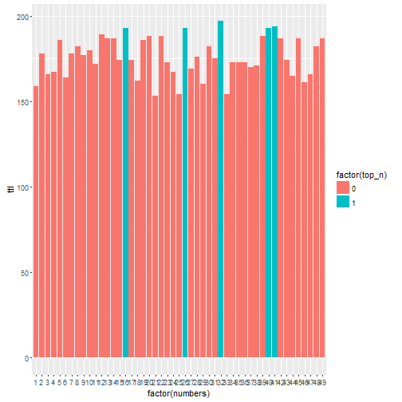

pitch
========================================================
author: Matt Gross
date: 2016-03-27
autosize: true

Slide 1 - Why
========================================================

This is my Rstudio Presentation pitch for my slidify app

- Haven't you always wanted to be rich?
- Do you have a lucky number?
- This app can help you choose the optimal lottery numbers based on your favorite number

Slide 2 - How
========================================================

The app begins assuming that the end user's favorite number is 7.  If the user's favorite number is different than 7, the user enters that number in the text fields in the top left text box, then adjusts the slider bar that limits the minimum occurance of historical powerball numbers.  The app then downloads all historical numbers from the powerball and filters all number sets based on those that include the favorite number.  From this limited set the app suggests the top number occurances from all number sets which historically included the user's favorite number.  This gives you the highest probability of winning given your favorite number is selected.


Slide 3 - Proof
========================================================

Assume my favorite number is 7:


```r
    ggplot(fn, aes(x=factor(numbers), y=ttl,fill=factor(top_n))) + geom_bar(stat="identity")
```



Slide 4 : Make It Happen
========================================================

Go to the store with your optimal numbers and buy lottery tickets.

Slide 5 : Win!
========================================================

Win, retire and collect your money!
